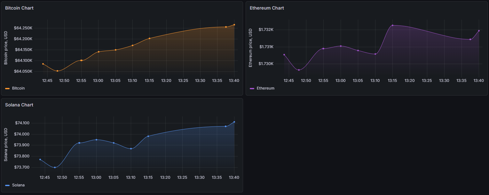

# Crypto ETL & Monitoring Pipeline

Пет-проект дата-пайплайна для сбора и визуализации стоимости криптовалют (Bitcoin, Ethereum, Solana).

## Архитектура проекта

Данные собираются из публичного API и проходят стандартный цикл ETL. Техническая база метаданных Airflow и целевая база бизнес-данных физически изолированы друг от друга в разных контейнерах.

```
[ CoinGecko API ]
        │ (REST JSON)
        ▼
[ Apache Airflow 3 ] ──► [ Слой трансформации (Pandas) ]
                                      │
                                      ▼ (SQL)
[ Grafana Dashboard ] ◄── [ Изолированная БД PostgreSQL ]

```

## Стек технологий

* **Оркестрация:** Apache Airflow 3.2.2
* **Обработка данных:** Python 3.13, Pandas, Requests.
* **Хранение данных:** PostgreSQL 16 (Alpine), Redis 7.2, pgAdmin 4
* **Визуализация:** Grafana
* **Среда:** Docker, Docker Compose

## Инструкция по запуску


### 1. Клонирование репозитория

```bash
git clone https://github.com/guardofnight/crypto-etl.git
cd crypto-etl-pipeline

```

### 2. Создание файла окружения

Создайте файл `.env` в корневом каталоге проекта. Он используется для инициализации прав системного пользователя Airflow и изоляции конфигурационных параметров:

```env
AIRFLOW_UID=50000
FERNET_KEY=

CRYPTO_DB_USER=
CRYPTO_DB_PASSWORD=
CRYPTO_DB_HOST=
CRYPTO_DB_NAME=

PGADMIN_EMAIL=
PGADMIN_PASSWORD=

```

### 3. Запуск контейнеров

Запустите контейнеры в фоновом режиме:

```bash
docker-compose up -d

```

## Доступы к веб-интерфейсам

| Сервис | URL | Логин             | Пароль              |
| --- | --- |-------------------|---------------------|
| **Airflow UI** | http://localhost:8080 | `airflow`         | `airlow`            |
| **Grafana** | http://localhost:3000 | `admin`           | `admin`             |
| **pgAdmin** | http://localhost:8888 | `PGADMIN_EMAIL` | `PGADMIN_PASSWORD` |

## Дашборд в Grafana
